# 🌟 Priyanshu Singh

<div align="center">
  
[](https://git.io/typing-svg)

</div>

<div align="center">
  
</div>

---

## 💫 About Me


```typescript
class Developer {
  name: string = "Priyanshu Singh";
  role: string = "Full Stack Developer";
  location: string = "Indore, India 🇮🇳";
  education: string = "B.Tech CSE @ Medi-Caps University";
  
  currentlyLearning: string[] = [
    "GraphQL", "Next.js", "System Design", "Microservices"
  ];
  
  askMeAbout: string[] = [
    "React", "Django", "REST APIs", "Web Architecture", 
    "Java", "Spring Boot", "System Design"
  ];
  
  funFact: string = "I debug with console.log and I'm not ashamed! 🐛";
  
  contact: {
    email: "priyanshu1561@gmail.com",
    linkedin: "Connect with me!"
  }
}
```

---

## 🛠️ Tech Arsenal

<div align="center">

### 🎨 Frontend Development
[](https://reactjs.org/)
[](https://nextjs.org/)
[](https://www.typescriptlang.org/)
[](https://developer.mozilla.org/en-US/docs/Web/JavaScript)
[](https://developer.mozilla.org/en-US/docs/Web/HTML)
[](https://developer.mozilla.org/en-US/docs/Web/CSS)
[](https://tailwindcss.com/)

### ⚙️ Backend Development
[](https://www.djangoproject.com/)
[](https://nodejs.org/)
[](https://www.python.org/)
[](https://www.java.com/)
[](https://spring.io/projects/spring-boot)
[](https://www.postgresql.org/)

### 🔧 Tools & DevOps
[](https://www.docker.com/)
[](https://git-scm.com/)
[](https://github.com/features/actions)
[](https://www.postman.com/)
[](https://www.figma.com/)
[](https://code.visualstudio.com/)

</div>

---

## 📊 GitHub Analytics

<div align="center">
  
  
</div>

<div align="center">
  
</div>

---
## 🏆 GitHub Trophies
<div align="center">
  
</div>

<br/>

<div align="center">
  
  
  
</div>

<br/>

<div align="center">
  
</div>


---

## 🔥 Current Projects & Focus

```mermaid
graph TD
    A[🚀 Current Learning Path] --> B[📚 GraphQL & Apollo]
    A --> C[⚡ Next.js 14]
    A --> D[🏗️ System Design]
    A --> E[🔧 Microservices]
    
    B --> F[💡 Building Scalable APIs]
    C --> G[🌐 Full-Stack Applications]
    D --> H[📊 Performance Optimization]
    E --> I[☁️ Cloud Architecture]
    
    style A fill:#00D9FF,stroke:#fff,stroke-width:2px,color:#000
    style F fill:#FF6B6B,stroke:#fff,stroke-width:2px,color:#fff
    style G fill:#4ECDC4,stroke:#fff,stroke-width:2px,color:#fff
    style H fill:#45B7D1,stroke:#fff,stroke-width:2px,color:#fff
    style I fill:#96CEB4,stroke:#fff,stroke-width:2px,color:#fff
```

<div align="center">
  


</div>

---

## 🎯 What I'm Working On

<div align="center">
  <table>
    <tr>
      <td align="center">
        
        <br><strong>React Projects</strong>
        <br>Building modern web apps
      </td>
      <td align="center">
        
        <br><strong>Django APIs</strong>
        <br>RESTful backend services
      </td>
      <td align="center">
        
        <br><strong>Spring Boot</strong>
        <br>Enterprise applications
      </td>
    </tr>
  </table>
</div>

---

## 🌐 Connect & Collaborate

<div align="center">
  
[](mailto:priyanshu1561@gmail.com)
[](https://linkedin.com/in/priyanshu-singh-a6ab63250)
[](https://github.com/priyanshu1561)
[](https://your-portfolio-link.com)

</div>

---


## 💭 Quote of the Day

<div align="center">
  
</div>

---

## 📈 Activity Graph

<div align="center">
  
</div>

---

## 🎨 Fun Stats

<div align="center">
  
  
  
</div>

---

<div align="center">
  
</div>

<div align="center">
  <i>⭐ Star my repositories if you find them interesting!</i>
</div>
